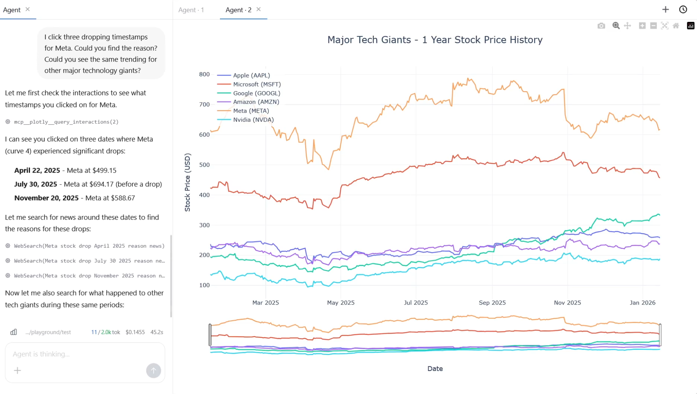
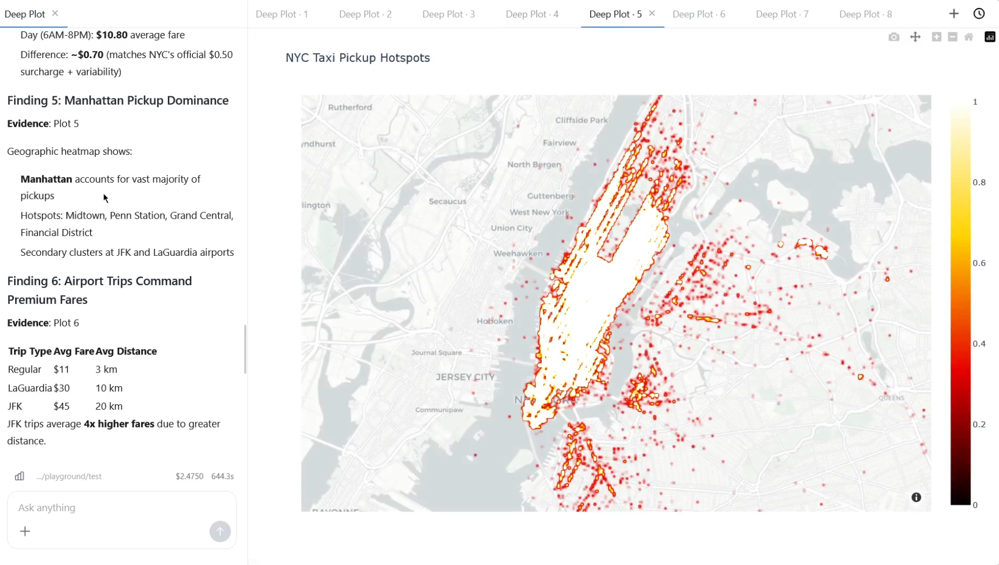
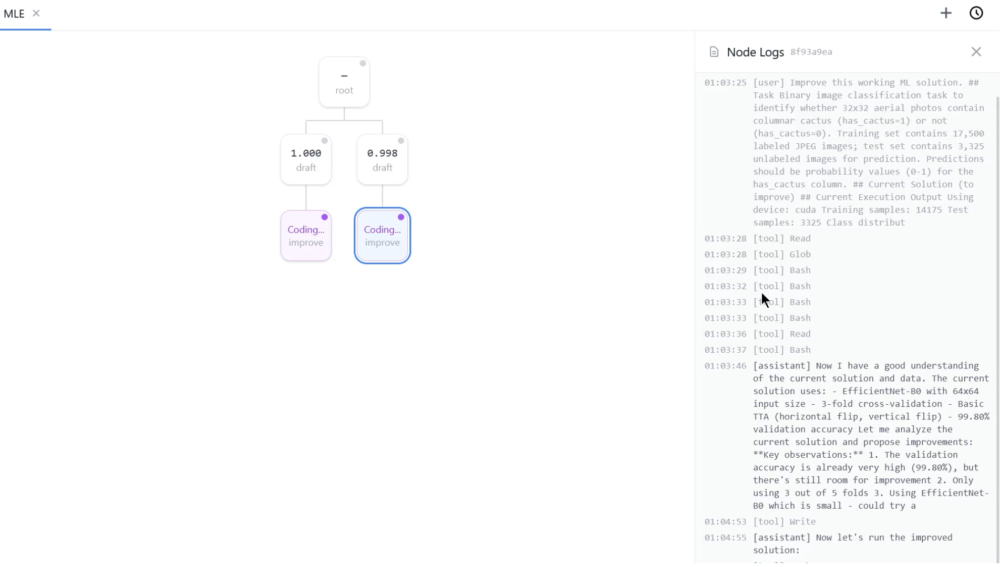

<h1 align="center">
  🌠Deep Data
</h1>

<p align="center">
  <i>An agent framework built on Claude SDK for data analysis, visualization, and ML automation.</i>
</p>


https://github.com/user-attachments/assets/ecfa27f8-2e3d-4fa5-9ca6-cdbeff77c04b


## Features

1. **Agent** - Coding agent with Visualization State API (IVG) for interactive chart creation and verification

   <p align="center">
     
   </p>


2. **Deep Plot** - Autonomous data analysis agent with iterative exploration and explanation

   <p align="center">
     
   </p>

3. **MLE** - MCTS-based ML solution search with parallel workers (isolated in Git worktrees)

   <p align="center">
     
   </p>

## Requirements

- **Python**: 3.10+
- **Node.js**: 18.x+ (for frontend build)
- **Claude API**: Via [Claude Code CLI](https://docs.anthropic.com/en/docs/claude-code)

## Setup

```bash
# Create virtual environment
python -m venv venv
source venv/bin/activate  # On Windows: venv\Scripts\activate

# Install dependencies
pip install -r requirements.txt
pip install -r requirements_ml.txt  # Optional, for ML tasks

# Build frontend
cd deepdata/web/frontend
npm install
npm run build
cd ../../..
```

## Quick Start

```bash
# Start web server
python -m deepdata.web.run_server

# With custom port
python -m deepdata.web.run_server --port 8080

# Set working directory
python -m deepdata.web.run_server --cwd /path/to/project
```

Visit `http://localhost:8000` for the Web UI.

## Paper

Our paper describing the IVG framework benchmark is coming soon on arXiv.
